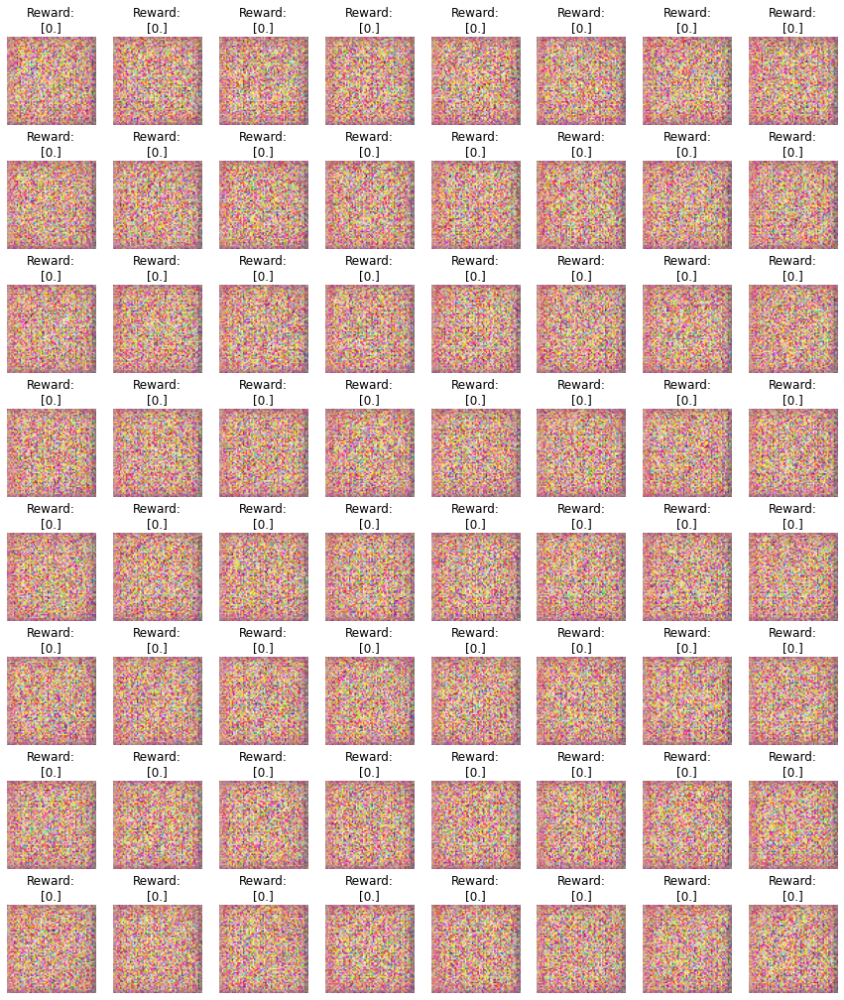
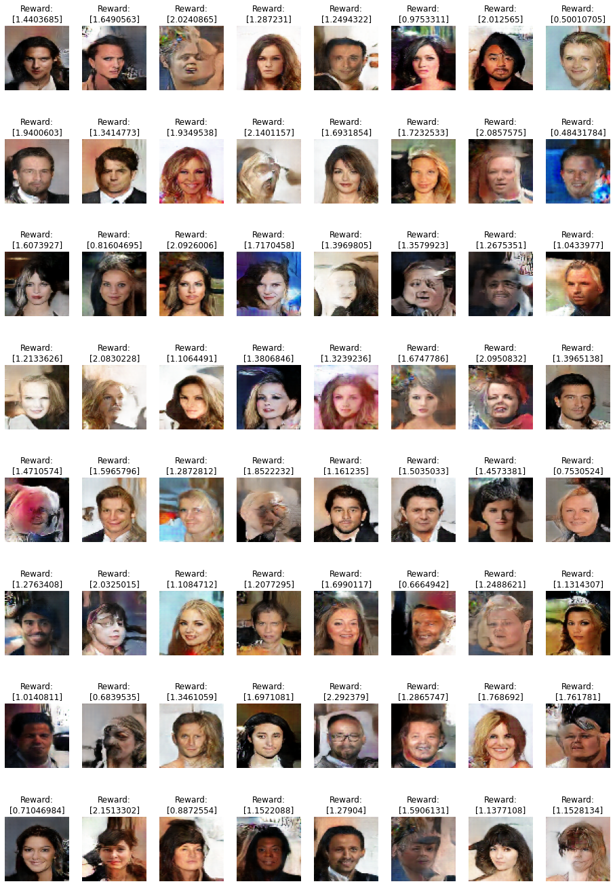

# Generative Adversarial Network

This repo is about using the Generative Adversarial Network (GAN) model for creating new faces with using CelebA dataset.

## References

- [Self-Attention Generative Adversarial Networks](https://arxiv.org/abs/1805.08318)
- [Unsupervised Representation Learning with Deep Convolutional Generative Adversarial Networks](https://arxiv.org/abs/1511.06434)
- [Information-theoretic stochastic contrastive conditional GAN: InfoSCC-GAN](http://bayesiandeeplearning.org/2021/papers/15.pdf)
- [Instance Normalization: The Missing Ingredient for Fast Stylization](https://arxiv.org/abs/1607.08022)
- [Spectral Normalization for Generative Adversarial Networks](https://arxiv.org/abs/1802.05957)
- [Large-scale CelebFaces Attributes (CelebA) Dataset](http://mmlab.ie.cuhk.edu.hk/projects/CelebA.html)

## Initial

## Results

----------------------------------

**Frameworks:** Tensorflow, WanDB, NumPy, Matplotlib
