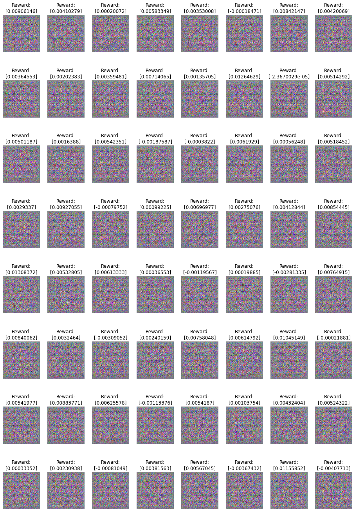

# GAN

This repo is about using the GAN model for creating new faces.

## Papers

- [Self-Attention Generative Adversarial Networks](https://arxiv.org/abs/1805.08318)
- [Unsupervised Representation Learning with Deep Convolutional Generative Adversarial Networks](https://arxiv.org/abs/1511.06434)
- [Information-theoretic stochastic contrastive conditional GAN: InfoSCC-GAN](http://bayesiandeeplearning.org/2021/papers/15.pdf)
- [Large-scale CelebFaces Attributes (CelebA) Dataset](http://mmlab.ie.cuhk.edu.hk/projects/CelebA.html)

## Init

## Results

